<!--
  Banners gerados no RyMe.md → https://ryme.md/editor
  Os .svg vivem em assets/ e são versionados junto com este README.
-->

 

<table>
<tr>
<td width="63%" valign="top">

### Sobre mim

Desenvolvedor full-stack na **mgCode** e estudante de Sistemas de Informação na **UFLA**.

Trabalho com **C# / .NET** no back-end e **TypeScript** no front e no mobile, em sistemas que já rodam em produção. Aplico Clean Architecture, CQRS e os padrões Repository e Unit of Work; no front e no mobile, organização modular com React e React Native.

Meu foco é arquitetura em camadas, responsabilidades bem separadas e código testado.

</td>
<td width="37%" align="center" valign="middle">

<i>com grandes commits vêm grandes responsabilidades</i>

</td>
</tr>
</table>

 

## Experiência

**mgCode** · Perdões, MG

| Cargo | Período |
| :--- | :--- |
| Desenvolvedor de software | jun/2026 – atual |
| Estagiário | mar/2026 – jun/2026 |

APIs em C# / .NET e NestJS, interfaces em React e React Native, persistência em PostgreSQL.

**Formação** — Bacharelado em Sistemas de Informação, Universidade Federal de Lavras (UFLA), em andamento.

 

## Stack

 

## Projetos em destaque

| Projeto | O que é | Stack |
| :--- | :--- | :--- |
| **[api-csharp-cqrs](https://github.com/AugustoFernandesc/api-csharp-cqrs)** | API de gestão de funcionários em CQRS, com um *background service* que gera PDFs e dispara relatórios por e-mail de forma idempotente e resiliente. | `.NET 10` `MediatR` `EF Core` `QuestPDF` `MailKit` `PostgreSQL` |
| **[TaskFlow](https://github.com/AugustoFernandesc/TaskFlow)** | Ecossistema fullstack de usuários e tarefas, com autenticação JWT e rotas protegidas ponta a ponta. | `NestJS` `TypeORM` `React` `TypeScript` `PostgreSQL` |
| **[api-csharp](https://github.com/AugustoFernandesc/api-csharp)** | API em Clean Architecture com Repository + Unit of Work, DTOs, BCrypt e validação desacoplada. | `.NET 10` `EF Core` `FluentValidation` `Swagger` |
| **[mobile-lab](https://github.com/AugustoFernandesc/mobile-lab)** | App React Native com arquitetura modular: registrar uma tela nova custa **uma linha** em arquivo central. | `React Native` `Expo` `React Query` `Jest` |
| **[zeus-frontend](https://github.com/AugustoFernandesc/zeus-frontend)** | ERP interno da Comp Júnior — membros, orçamentos, dashboards e upload validado de imagens. | `React` `Vite` `Styled-Components` |
| **[meu-primerio-jogo-2d](https://github.com/AugustoFernandesc/meu-primerio-jogo-2d)** | *Zenith's Journey* — jogo 2D na Godot: mecânicas de movimento, colisão e interface. | `Godot` `GDScript` |

 

## GitHub

 

## Onde me achar

